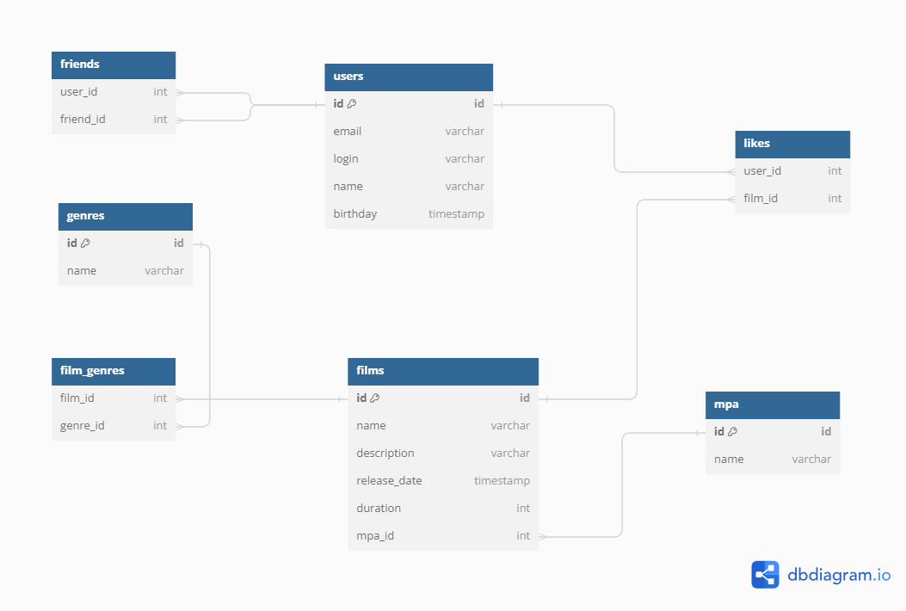

# java-filmorate


-**users** таблица пользователей
-**friends** таблица для отображения связей друзей 
-**likes** таблица для отображения связей лайков пользователей и фильмов
-**films** таблица фильмов 
-**mpa** таблица mpa-рейтингов фильмов 
-**genres** таблица жанров фильмов
-**film_genres** соединительная таблица для связи многие ко многим таблиц **films** и **genres**

Получим всех пользователей:
```
SELECT *  
FROM users;
```

Получим все фильмы:
```
SELECT *  
FROM films;
```

Получим топ 5 фильмов:
```
SELECT f.name, COUNT(l.user_id) AS count_likes
FROM films AS f
LEFT JOIN likes AS l ON f.id = l.film_id
GROUP BY f.id
ORDER BY count_likes DESC
LIMIT 5;
```
